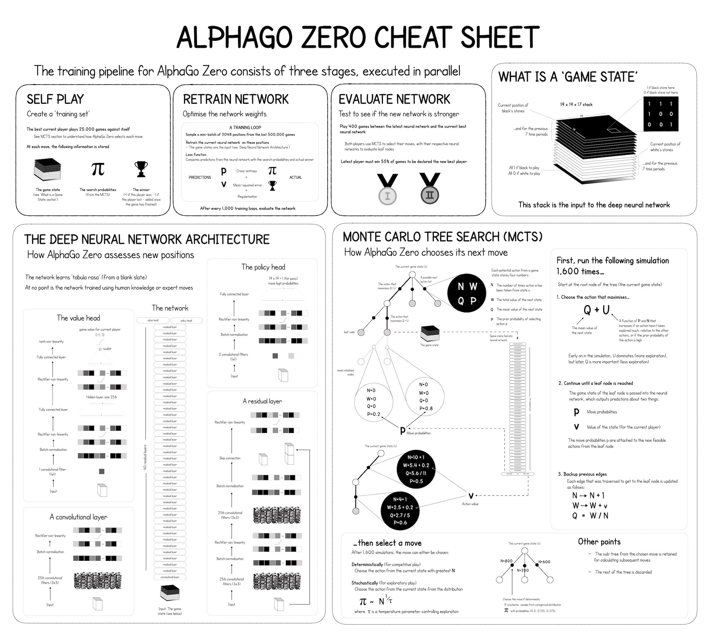

# Alpha Zero NS
이 프로젝트는 2017년 12월 5일 Google Deepmind에서 발표한 [일반화된 강화학습 알고리즘을 활용한 자가 경기를 통해 체스와 쇼기 게임 마스터하기 (Mastering Chess and Shogi by Self-Play with a General Reinforcement Learning Algorithm)](https://arxiv.org/pdf/1712.01815.pdf)에 기술된 알파제로 (AlphaZero) 에이전트를 파이썬과 Keras로 구현한 것입니다. 

Tensorflow의 유용한 강화학습 라이브러리들이 있지만, 아직 강화학습 라이브러리들은 잘 정리가 되어 있지 않아 모든 클래스들은 직접 만들었고, 신경망의 경우 Keras.Model을 활용하였습니다.

알파제로는 Model-Free Actor-Critic Policy Gradient 에이전트이며, Function Approximation 방법으로는 Residual CNN을 활용했습니다. 알파제로의 원리를 이해하기 쉬운 사진이 있어 첨부해 놓겠습니다. ([출처](https://medium.com/applied-data-science/alphago-zero-explained-in-one-diagram-365f5abf67e0))

- **Self Play**: 게임 플레이 데이터를 생성하기 위해 현재 가장 좋은 모델이 스스로 대국을 합니다. 
- **Retraining Network**: Self Play의 플레이 데이터를 이용하여 신경망을 학습시킵니다. 
- **Evaluate Network**: Retrain 과정을 거친 모델과 현재 가장 좋은 모델이 대국합니다. 만약 Retrain 과정을 거친 모델이 현재 가장 좋은 모델을 압도한다면, 그 모델이 가장 좋은 모델이 됩니다. 



이 프로젝트의 경우, 입체사목 (Connected Four) 게임을 하는 에이전트가 구현되어 있습니다. 하지만 이 프로젝트의 에이전트는 알파제로의 구현체이므로 [game.py](##game.py-(Editable)) 파일을 교체하여 모든 턴제 게임에 활용할 수 있습니다. (games 파일의 여러 게임 참고) 다만, 이 알파제로와 같이 에이전트가 학습할 수 있는 게임의 조건에는 다음이 있을 것으로 예상됩니다.

- **2인 게임이어야 합니다.** 이 프로젝트를 만들 때부터 바둑, 체스, 오목 등의 2인 게임을 목표로 만들었기 때문에 3인 이상이 참여하는 게임은 학습할 수 없습니다. 
- **정적인 턴제 게임이여야 합니다.** 에이전트는 몬테 카를로 트리 검색 (MCTS, Monte Carlo Tree Search) 을 활용하는데. 철권 시리즈, 리그 오브 레전드와 같이 연속적이고 실시간 플레이가 필요한 경우 이 에이전트의 MCTS는 낮은 성능을 보일 것으로 예상됩니다. 
- **에이전트의 관찰 (Observation) = 게임의 상태 (State) 여야 합니다.** 다시 말해, 에이전트가 게임의 모든 정보를 알고 있어야 합니다. 바둑, 오목, 체스의 경우 에이전트가 판 위의 상황을 모두 알기 때문에 MCTS를 효과적으로 사용할 수 있습니다. 하지만 스타크래프트처럼 Observation이 State의 일부인 경우, MCTS의 성능이 낮아질 것으로 예상됩니다.
- **에이전트의 행동 (Action) 이 이산적 (Discrete) 이어야 합니다.** 바둑의 경우 최대 19 x 19 = 361개의 착점 중 하나를 선택하여 돌을 놓을 수 있습니다. 체스 또한 유한한 선택지 중 하나를 선택하여 말을 옮길 수 있습니다. 하지만 이 프로젝트에서는 에이전트의 행동이 이산적이라고 가정했기 때문에, 에이전트의 행동이 연속적 (Continuous) 이어야 하는 알까기 같은 게임은 이 프로젝트에 적용할 수 없습니다. (알까기 게임에서 돌을 튕기는 힘을 몇 단계로 나눌 수 있다면 적용할 수 있을 것 같습니다.)

위의 조건들을 만족하는 그 어떤 게임도 이 프로젝트에 적용할 수 있을 것입니다. 만약 조건에 빠뜨린 내용이 있거나 필요 없는 조건이 있다면, 수정 이후 글로 남겨 놓겠습니다. 


# Example Result
기본적으로 구현되어 있는 입체사목 게임을 목표로 며칠 동안 학습을 돌려 보았습니다. 
먼저, 제 컴퓨터의 사양은 아래와 같습니다. 
- CPU: AMD Ryzen 3 3600
- GPU: NVIDIA GeForce RTX 2060 Super
- Tensorflow: 2.4.0
- CUDA: 11.0
- CUDNN: cudnn-11.0-windows-x64-v8.0.4.30

약 3일간 학습을 시킨 결과, 아래와 같은 결과를 낼 수 있었습니다. 
상단의 빨간 선은 policy head의 loss function, 하단의 파란 선은 value head의 loss function, 
그리고 가운데의 검은 선은 두 loss function의 평균입니다. 


컴퓨터가 너무 힘들어 하는 것 같아 학습을 중단시켰지만, 
그래프의 방향으로 보아 학습을 좀 더 진행하면 더 좋은 에이전트를 얻을 수 있을 것 같습니다. 

학습된 에이전트끼리 실제로 대국한 결과입니다. 
총 2판의 대국을 하였고, 선턴과 후턴으로 1판씩 대국하였습니다. 

## version 1 vs version 2
Monte Carlo Tree Search 덕분에 상대가 3개의 연속된 돌을 두었을 때 막는 모습은 보여줍니다. (막지 않는 경우도 있는데, MCTS 과정에서 지는 미래가 발견되지 않은 경우인 것으로 보입니다.) 

하지만 막 두다가 상대가 3개의 돌을 연속으로 두었을 때만 막는다는 느낌입니다. 

- green (version 1), red (version 2): GREEN (VERSION 1) WON!


- green (version 2), red (version 1): GREEN (VERSION 2) WON!


## version 30 vs version 31
이 게임에서 가운데 줄이 좋다는 것은 version 1, 2때부터 학습되어 있었습니다. 따라서 초기 버전들은 가운데 3개의 줄을 끝까지 채우고 시작했습니다. 

그러나 30, 31번째 모델은 가운데 3개의 줄을 적당히 채운 뒤, 양쪽의 줄들에 자신의 돌을 배치하여 가운데 줄과 이으려는 모습을 보여줍니다. 

또한, 판이 거의 다 채워져 갈 때, 자신이 놓으면 상대가 이길 수도 있는 줄이나 상대가 놓으면 자신이 이길 수 있는 줄을 피해 다른 의미 없는 줄에 자신의 턴을 써버리는 전략을 사용하기도 합니다. 

- green (version 30) vs red (version 31): RED (VERSION 31) WON!
(판이 무승부로 찬 경우 선턴이 패배합니다.)

- green (version 31) vs red (version 30): GREEN (VERSION 31) WON!


## version 31 vs myself
- green (version 31) vs red (myself): RED (MYSELF) WON!

- red (myself) vs green (version 31): RED (VERSION 31) WON!


# Tech Stack
- Windows 10
- Pipenv
- Python 3.7.6
- Tensorflow 2.4.0
- Keras 2.4.3
- CUDA 11.0
- CuDNN 8.0.4 for CUDA 11.0


# Requirements
- requirements.txt에 사용한 파이썬 패키지들이 있습니다. 
- Keras Model을 시각화하기 위해 오픈소스 다이어그램 생성기 graphviz ([다운로드](https://graphviz.org/download/)) 를 사용했습니다. 


# How To Run
## 클론 및 가상 환경 설정
이 프로젝트를 클론하고, 필요한 패키지들을 설치하는 방법입니다. 만약 이 프로젝트에 대한 가상 환경을 생성하지 않을 것이라면, 4 ~ 8단계를 건너 뛰어도 좋습니다. 그러나 이미 설치된 tensorflow 버전이 2.4.0이 아니라면 가상 환경을 생성하는 것이 좋습니다.

1. CMD나 terminal을 실행하고, 프로젝트를 클론하고 싶은 디렉토리로 이동합니다. 
2. ```git clone https://github.com/yurangja99/alpha-zero-ns.git``` 명령으로 이 프로젝트를 클론하거나, zip 파일을 다운로드하여 압축을 해제합니다. 
3. ```cd alpha-zero-ns``` 명령으로 이 프로젝트의 루트 디렉토리로 이동합니다. 
4. ```pip install pipenv``` 명령을 실행하여 Pipenv를 설치합니다. 
5. ```pipenv --python 3.7.6``` 명령을 실행하여 이 프로젝트에 대한 가상 환경을 생성합니다. 
6. ```pipenv shell``` 명령으로 가상 환경을 실행합니다. CMD 혹은 terminal의 앞에 ```(alpha_zero_ns-XXXXXXXX)```가 추가되는 것을 확인합니다.
7. ```pip install -r requirements.txt``` 명령으로 필요한 패키지들을 설치합니다. 
8. ```exit``` 명렁으로 가상 환경을 종료합니다. 
9. graphviz ([다운로드](https://graphviz.org/download/)) 를 설치합니다.

## 커스텀 게임 적용하기
이 프로젝트에는 입체사목 (Connected Four) 게임이 적용되어 있으나, 다른 알려진 게임이나 직접 정의한 커스텀 게임을 하는 에이전트를 학습시킬 수 있습니다.

1. [GameEnv의 조건](###GameEnv)과 [GameState의 조건](###GameState)를 만족하는 GameEnv, GameState 클래스를 [game.py](##game.py-(Editable))에 정의합니다. (games 폴더의 여러 게임들을 참고합니다.) 
2. 루트 디렉토리의 [game.py](##game.py-(Editable))를 새로 정의된 [game.py](##game.py-(Editable))로 바꿉니다. 
3. [config.py](##config.py-(Editable))의 하이퍼 파라미터들을 알맞게 수정합니다. 알맞은 하이퍼 파라미터들을 설정하는 공식은 없지만, 새로 정의된 게임을 Connected Four 게임과 비교하며 설정하면 될 것으로 예상됩니다. 

## 프로젝트 실행
루트 디렉토리에 적용된 게임을 하는 에이전트를 학습시키는 방법입니다. 

1. 프로젝트의 루트 디렉토리로 이동합니다.
2. ```pipenv shell``` 명령으로 가상 환경을 실행합니다. 
3. ```python main_train.py``` 명령으로 학습을 시작합니다. ```python main_train.py --help``` 명령을 실행하면 파라미터들에 대한 설명을 볼 수 있습니다. (--run-number, --memory-version, --model-version) 첫 실행 시에는 이를 사용하지 않고, 하단의 [아카이브 활용](##아카이브-활용)에서 사용합니다. 
4. 학습을 중단하고 싶다면, ctrl + C로 종료합니다. 
5. ```exit``` 명령으로 가상 환경을 종료합니다. 

## 아카이브 활용
단 한 번의 학습으로 완벽한 에이전트를 학습시키기에는 무리가 있습니다. 또한, 만족할 만한 성능을 얻기 위해서는 수 일 동안 학습을 진행해야 하는데, 그동안 컴퓨터를 계속 켜 두기에도 무리가 있습니다. 

따라서 학습의 어느 지점마다 그 지점의 학습 상황을 저장해 두는 폴더가 있습니다. [setting.py](##setting.py-(Editable))에 run_folder로 정의되어 있으며, 디폴트 값은 './run'입니다. 이를 [setting.py](##setting.py-(Editable))의 run_archive_folder (디폴트 './run_archive') 로 옮겨 저장하면 나중에 이어서 학습할 수 있습니다. 

1. 프로젝트 실행 중 ctrl + C로 종료합니다. 그 이후 run 폴더에 들어가 보면, logs, memory, models, config.py 등 여러 폴더 및 파일들을 볼 수 있습니다. 
2. run_archive 폴더에 들어가 "[게임 이름](###GameEnv)" 폴더가 있는지 확인합니다. 없다면 생성합니다. 
3. run_archive/{게임 이름} 폴더에 루트 디렉토리의 run 폴더를 통째로 복사하여 넣습니다. 그리고 그 폴더의 이름을 6자리 숫자로 바꿉니다. 예를 들어, 'run_archive/connected_four/run123456' 로 바꿀 수 있습니다. 
4. 만약 저장된 아카이브에서 학습을 시작하고 싶다면, run_archive/{게임 이름} 폴더에서 시작하고자 하는 run 폴더 번호, memory 버전, model 버전을 확인합니다. memory 버전은 run_archive/{게임 이름}/runXXXXXX/memory에 있는 버전 중 선택해야 하며, model 버전 또한 run_archive/{게임 이름}/runXXXXXX/models에 있는 버전 중 선택해야 합니다. 
5. 아카이브에서 시작하고자 하는 run 폴더 번호, memory 버전, model 버전을 선택했다면, ```python main_train.py --run_number {run 번호} --memory_version {memory 버전} --model_version {model 버전}``` 명령을 실행하여 그 지점부터 학습을 시작할 수 있습니다. 

## 여러 모델 테스트
여러 모델 버전들이 서로 대국을 하도록 해 보고 싶을 수 있습니다. 예를 들어, 1번재 버전과 20번째 버전이 붙었을 때, 20번째 버전이 1번째 버전보다 얼마나 발전했는지 알고 싶을 수 있습니다. 

1. 프로젝트의 루트 디렉토리로 이동합니다.
2. ```pipenv shell``` 명령으로 가상 환경을 실행합니다. 
3. ```python main_league.py``` 명령으로 학습을 시작합니다. ```python main_league.py --help``` 명령을 실행하면 파라미터들에 대한 설명을 볼 수 있습니다. (--include-user, --render-option, --plot-result)
4. run number를 입력하라고 하면, 원하는 모델들이 들어 있는 아카이브 폴더의 번호를 입력합니다. 
5. 입력한 run number에 속한 모델 리스트가 출력됩니다. 서로 붙여 보고 싶은 2개 이상의 모델을 선택합니다. -IU 모드를 사용했다면 하나의 모델만 선택해도 됩니다. 
6. 결과가 나올 때까지 기다립니다. 
7. ```exit``` 명령으로 가상 환경을 종료합니다. 


# Files
이 프로젝트는 각자의 역할을 하는 여러 파일들로 이루어져 있습니다. 순서대로 읽으면서 이해하기 쉽도록 순서를 배치해 두었습니다. 

## setting.py (Editable)
이 프로젝트의 세팅 값들을 저장하는 파일입니다. 딱히 설정할 게 없어서, 아카이브 관련 설정들만 있는 상태입니다. 
- run_folder: 학습 진행 상황이 저장되는 폴더 경로입니다.  
- run_archive_folder: 아카이브된 진행 상황을 로드하는 폴더 경로입니다. 

## config.py (Editable)
에이전트 및 학습에 영향을 주는 하이퍼 파라미터들이 정의되어 있는 파일입니다. 에이전트의 구조에 영향을 주기도 하며, self play, retraining, tournament 과정에 영향을 주기도 합니다. 실행 시간과 성능에 큰 영향을 주게 되므로 신중하게 설정해야 합니다. 

## game.py (Editable)
에이전트가 학습할 게임이 정의되어 있는 파일입니다. 전반적인 게임의 정보를 관리하는 GameEnv 클래스와 게임의 각 상태 (State) 를 관리하는 GameState 클래스가 정의되어 있습니다. 

기본적으로 입체사목 (Connected Four) 게임이 설정되어 있으나, 커스텀 게임을 적용할 수도 있습니다. 커스텀 게임에 맞는 GameEnv, GameState 클래스를 만들어 기존의 것을 대체하면 되는데, 그 조건은 아래와 같습니다. 

### GameEnv
게임의 이름, 턴, 상태, 종료되었는지의 여부 등 전체적인 정보를 관리합니다. 
- self.name: str 타입의 게임 이름으로, 아카이브 시 사용됩니다. 
- self._turn: 0 혹은 1 값을 가지는 int 값입니다. 
- self._state: GameState 인스턴스로, 현재 게임 상태를 나타냅니다. 
- self._episode_ended: bool 타입으로, 게임이 끝난 상태인지 알려 주는 값입니다. 
- self._observation_spec: dict 타입으로, 에이전트에게 제공되는 observation의 형태를 나타냅니다. 이 프로젝트의 경우 observation = state + turn이므로 state의 spec을 설정하면 됩니다. (turn 정보로는 shape가 변하지 않도록 GameState.model_input 필드를 설정했습니다.) key로는 shape, dtype, min, max가 필요합니다. 
  ```
  self._observation_spec = { 'shape': self._state.state.shape, 'dtype': np.int32, 'min': 0, 'max': 1 }
  ```
- self._action_spec: dict 타입으로, 에이전트가 수행하는 행동 (Action) 의 형태를 나타냅니다. key로는 shape, dtype, min, max가 필요합니다. 
  ```
  self._action_spec = { 'shape': (1,), 'dtype': np.int32, 'min': 0, 'max': 6 }
  ```
- self.action_spec(): self._action_spec을 반환합니다. 
- self.observation_spec(): self._observation_spec을 반환합니다. 
- self.state(): 에이전트에게 observation을 제공합니다. Observation=state이므로 self._state를 반환합니다. 
- self.turn(): self._turn을 반환합니다. 
- self.reset(): 게임을 초기화합니다. 
- self.identities(state, action_values): 주어진 state (GameState 인스턴스) 와 action_values (np.array) 와 동일한 (state, action_values) 목록을 반환합니다. 예를 들어, 바둑의 경우 어떤 상태에서 우상귀에 두는 것은 그 상태를 시계 방향으로 90도 돌린 상태에서 우하귀에 두는 것과 같습니다. 이러한 동일한 (state, action_values) 목록을 이용하여, 한 번의 시뮬레이션으로 여러 개의 데이터를 얻는 효과를 낼 수 있습니다. 
- self.step(action): GameEnv 클래스의 핵심이라고 볼 수 있는 함수로, 현재 상태 (self._state) 에 현재 플레이어가 (self._turn) 어떤 행동을 했을 때, 게임의 전체적인 정보를 알맞게 수정하고 그 정보를 에이전트에게 돌려줍니다. (next_state, reward, done, info) 형태의 tuple이 반환되게 됩니다. GameState의 step(action) 함수를 활용하므로, 해당 함수의 설명을 보면 이해가 빠를 수 있습니다. 

### GameState
게임의 어떤 상태에 대한 정보를 저장합니다. 에이전트가 몬테 카를로 트리 탐색 (MCTS) 을 수행할 때 많이 사용됩니다. 
- self.state: np.array 타입으로, 게임의 상태를 저장합니다. GameEnv 클래스의 self._observation_spec과 같은 형태여야 합니다. 
- self.turn: 0 혹은 1의 값을 가집니다. 
- self.key: GameState 인스턴스가 생성될 때 자동으로 생성되는 MCTS에서 사용하는 key 값입니다. 각 state마다 유일해야 합니다. 
- self.model_input: 실제로 에이전트의 모델에 들어갈 np array를 저장합니다. 
- self.black_win: 해당 state에서 turn=0인 사용자가 이겼는지 알려 주는 bool 값입니다.
- self.white_win: 해당 state에서 turn=1인 사용자가 이겼는지 알려 주는 bool 값입니다. 
- self.render(mode, logger): self.state를 시각화합니다. 
  - mode='rgb_array': self.state를 RGB 이미지로 반환합니다. (width, height, 3) 형태의 np.array를 반환해야 합니다. 
  - mode='log', logger={some_logger}: 주어진 logger에 self.state를 출력합니다. 출력 형태는 자유롭게 바꿀 수 있습니다. 
  - mode='human': RGB 이미지로 변환된 self.state를 plot합니다.
- self.step(action): 해당 self.state에 self.turn 에이전트가 주어진 action을 했을 때의 결과를 반환합니다. (next_state, reward, done, info)를 반환하며, 각각의 역할은 아래와 같습니다.
  - next_state는 GameState 인스턴스로, 다음 state를 나타냅니다. 
  - reward는 float 타입으로, 다음 차례의 에이전트에게 주어지는 보상입니다. 만약 직전 플레이어의 움직임으로 자신이 졌다면 -1, 이겼다면 +1, 비겼다면 0으로 설정합니다. 
  - done은 직전 action으로 게임이 끝났는지를 나타내는 bool 값입니다.
  - info는 None으로 고정합니다. 여기에서는 사용하지 않고, 이후 MCTS 클래스에서 사용합니다. 

## memory.py
대국 데이터를 저장하는 메모리가 정의된 파일입니다. Self Play의 대국 기보가 저장되며, Retraining 시 여기에 저장된 기보가 사용됩니다. 
### Memory
기보 데이터를 저장하며, short term memory와 long term memory로 나뉘어져 있습니다. Short term memory에 한 에피소드의 대국 정보가 저장된 이후 long term memory에 옮겨지게 됩니다. 그 이유는 Memory에 에피소드의 승패를 저장해야 하는데, 에피소드가 끝나기 전까지 그 에피소드의 승패를 알 수 없기 때문입니다. 

따라서 에피소드 진행 중에는 short term memory에 기보를 저장하다가, 에피소드가 끝나면 기보 전체에 승패를 기록하고 long term memory로 넘기는 방식을 사용합니다. 

## logger.py
학습이 잘 진행되고 있는지, 그리고 에이전트가 무슨 생각을 하고 있는지 알기 위해서는 출력을 해야 합니다. 하지만 컴퓨터는 아주 많은 연산을 하므로 출력을 한다면 우리가 알아 보기 힘들 것입니다. 또한, 에이전트가 한 생각을 따로 저장해 두고 싶을 수도 있습니다. 따라서 파이썬의 logging 패키지를 응용한 logger들을 정의해 두었습니다. 
- main_logger: 전체적인 학습 진행 상황을 기록합니다. 
- memory_logger: 메모리에 저장된 값들 중 일부를 보여줍니다.
- model_logger: 모델의 파라미터 값들의 통계를 보여줍니다.
- mcts_logger: 에이전트가 MCTS를 어떻게 활용하는지 (어떻게 미래의 수들을 생각하는지) 기록합니다. 
- tournament_logger: 현재 모델과 가장 좋은 모델의 대국 기보를 기록합니다. 

## MCTS.py
몬테 카를로 트리 탐색을 구현해 놓은 파일입니다. 몬테 카를로 트리 탐색 클래스 MCTS와 그를 구성하는 Node, Edge 클래스가 정의되어 있습니다. 

### MCTS
몬테 카를로 트리 탐색 하나를 클래스로 만들어 놓은 것입니다. 루트 노드, 트리를 가지고 있습니다. 

트리는 dict 타입인데, 해당 MCTS 클래스에 속하는 노드들을 저장해 두고 있습니다. key는 노드에 저장되는 state의 key를 사용합니다. 

### Node
몬테 카를로 트리에 포함되어 있는 노드들을 클래스로 만들어 놓은 것입니다. 해당 노드에 해당하는 상태 (State) 를 저장하고 있습니다. 

또한, 다른 Node와 Edge로 연결되어 있습니다. 그 Edge 인스턴스들은 self.edges에 저장되어 있으며, Edge는 단방향이므로 부모 노드의 self.edges에만 해당 Edge가 저장되어 있습니다. 

### Edge
어떤 상태에서 다른 상태로 이어지는 행동에 대한 정보를 저장합니다. self.stats에 통계를 저장하기도 합니다. 
- N: 해당 Edge대로 행동한 횟수
- W: 해당 Edge의 reward 총합
- Q: 해당 Edge의 reward 평균 (W / N)
- P: 신경망을 통해 계산한 해당 Edge (state-action pair) 의 실행 확률

## model.py
에이전트가 어떤 상태를 평가하는 신경망을 정의하여 놓은 파일입니다.

### ResidualCNNManager
Residual block 들을 활용하여 value, policy를 반환하는 CNN 모델을 만들고 관리할 수 있는 클래스입니다.

## agent.py
게임을 할 수 있는 에이전트입니다. 위에서 정의한 GameEnv 게임을 하며, MCTS와 ResidualCNNManager를 활용하여 어떤 행동을 할지 결정합니다. 

### User
가상의 에이전트로, 사람의 입력을 받아 행동을 합니다. 

### Agent
자신에게 할당된 MCTS 구조와 ResidualCNNManager 모델을 활용하여 머릿속으로 시뮬레이션을 돌려 보고, 각 상태를 평가하며, 어떤 행동을 할지 결정합니다. 
- self.__simulate(): MCTS를 활용하여 시뮬레이션을 돌려 봅니다. 인간으로 비유하면, 앞으로의 몇 수 정도를 머릿속에서 여러 번 예상해 보는 과정입니다. 
- self.act(state, tau): 주어진 GameState 인스턴스에 대해, 에이전트가 어떤 행동을 할지 반환합니다. 우선 self.__simulate() 함수로 앞으로 몇 수 정도를 시뮬레이션을 해 봅니다. 그 이후, 가장 승률이 좋을 법한 행동을 선택하여 반환합니다. tau는 temperature parameter인데, 0이면 무조건 가장 좋은 행동을 하며 1이라면 확률적으로 차선의 수들도 둡니다. 
- self.replay(long_term_memory, training_loops, epochs, batch_size): 주어진 기보를 활용하여 자신의 ResidualCNNManager 모델을 학습합니다. (Retraining)

## tournament.py
두 에이전트를 대국시키고, 그 결과를 반환하는 클래스입니다. Self Play 단계에서는 하나의 에이전트가 서로 대국하게 하며, Tournament 단계에서는 현재 에이전트와 현재의 최고 에이전트가 붙게 됩니다. 

## test.py (Executable)
개발 시 많이 활용했던 파일로, 구현이 제대로 되었는지 확인할 수 있는 함수들이 구현되어 있습니다. 여러 파일들의 동작 방식을 확인하기에 좋습니다. 

## main_train.py (Executable)
이전까지 구현한 모든 클래스들을 활용하여 에이전트를 학습시키는 파일입니다. 
1. GameEnv, Memory, ResidualCNNManager 초기화
2. run_number, memory_version, model_version이 주어졌다면 그에 해당하는 config.py, Memory, ResidualCNNManager 로드
3. 현재 에이전트와 가장 좋은 에이전트 정의
4. 학습 반복문 시작
    1. Self Play
    2. Retrain Network
    3. Tournament

## main_league.py (Executable)
마찬가지로 이전까지 구현한 모든 클래스들을 활용하며, 학습된 모델들을 테스트합니다. 
--include-user argument를 적용한다면, 사용자도 리그에 참여할 수 있습니다. 

기본적으로 리그는 full-league 형식으로 진행되며, 모든 모델은 다른 모든 모델과 대국합니다. 
대국은 기본적으로 2판 (선턴 1판, 후턴 1판) 으로 구성되며, 원한다면 코드의 값을 고치면 됩니다. 

# Trouble Shooting
## Pydot Problem
Keras의 plot_model() 함수를 이용하여 모델을 시각화하고 싶다면 graphviz와 pydot 패키지를 이용해야 합니다. graphviz와 pydot이 서로 호환되지 않는지, 알 수 없는 오류가 발생했습니다. 
```
"dot" with args ['-Tps', 'C:\\Users\\Username\\AppData\\Local\\Temp\\tmp5jhtvsxv'] returned code: 1

stdout, stderr:
 b''
b'Format: "ps" not recognized. Use one of:\r\n'
```
CMD (macOS나 Linux의 경우 terminal) 를 관리자 권한으로 열고 ```dot -c``` 명령어를 입력하니 해결되었습니다. 

## CUDA_ERROR_LAUNCH_FAILED: unspecified launch failure
Windows 10 컴퓨터에서 학습을 시키다 발생한 문제입니다. 
학습 초반에는 일어나지 않지만, 학습을 진행하다 보면 다음과 같은 CUDA 에러가 일어날 때가 있습니다. 
```
tensorflow.python.framework.errors_impl.InternalError: Could not synchronize CUDA stream: CUDA_ERROR_LAUNCH_FAILED: unspecified launch failure
2021-01-30 18:23:25.911295: E tensorflow/stream_executor/cuda/cuda_driver.cc:714] failed to unload module 0000010D6213DDB0; leaking: CUDA_ERROR_LAUNCH_FAILED: unspecified launch failure
```
이 문제는 Tensorflow가 지원하는 CUDA와 CuDNN 버전을 사용하지 않아 생긴 문제였습니다. 
CUDA 11.0와 CuDNN 8.0.4 버전을 사용하니 문제가 해결되었습니다. 

## Strange Learning Curve
학습을 시작했는데, 아래 사진과 같이 overall loss가 갑자기 뛰는 현상이 있습니다. 


여러 실험을 거쳐 본 결과, Adam Optimizer를 사용했을 때 이러한 문제가 발생함을 알 수 있었습니다. 
Model의 Optimizer를 SGD (Stochastic Gradient Descent) 로 변경하니, 아래와 같이 정상적인 학습 곡선이 그려졌습니다. 


# Future Goals
- 3인 이상이 참여하는 게임을 학습할 수 있도록 하기
- 턴제 게임이 아닌 실시간 조작이 필요한 게임 (atari, 철권 등) 에 이 알고리즘을 적용하여 DQN 이상의 성능을 내기
- Observation이 State의 일부인 경우에도 충분한 성능을 낼 수 있는 알고리즘 구상


# Contributors
- yurangja99